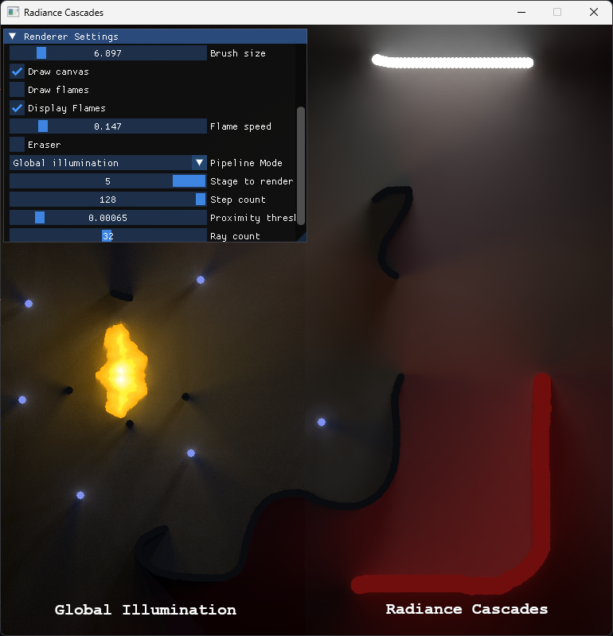
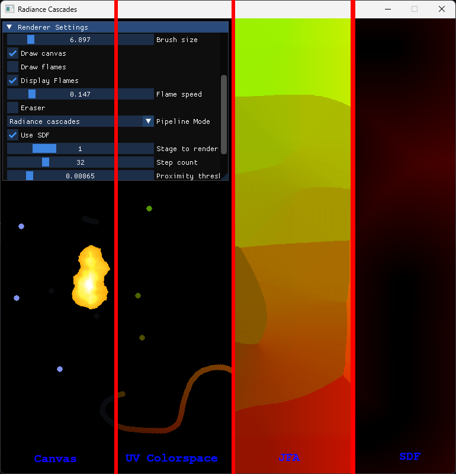

# Radiance Cascades



### Modes:

- Classic Global Illumination
- Radiance Cascades
- Cached Radiance Cascades - this mode sacrifices memory complexity to achieve higher FPS by rendering higher level cascades less frequently.



### Pipeline steps:

- Canvas
- Flame Generation
- Transformation to UV Colorspace
- JFA
- SDF
- GI / RC / CRC

### Settings:

- Brush color,
- Brush / Flame size,
- Eraser toggle,
- Flames toggle,
- Flame speed,
- Mode selector,
- SDF toggle for radiance cascades presets,
- Stage to render selector,
- Raymarching step count,
- Raymarching ray count,
- Raymarching proximity treshold,

### Measuring

To measure performance first `Measure` than `Save results`. Program measures performance on per node basis - you will get a file structured like that:

```
NodeName Sample1 Sample2 Sample3
NodeName1 Sample1_1 Sample1_2 Sample1_3
```

Each sample is the amount of `microseconds` it took to render specific stage of the pipeline. If the node is turned on it will NOT register the samples.
