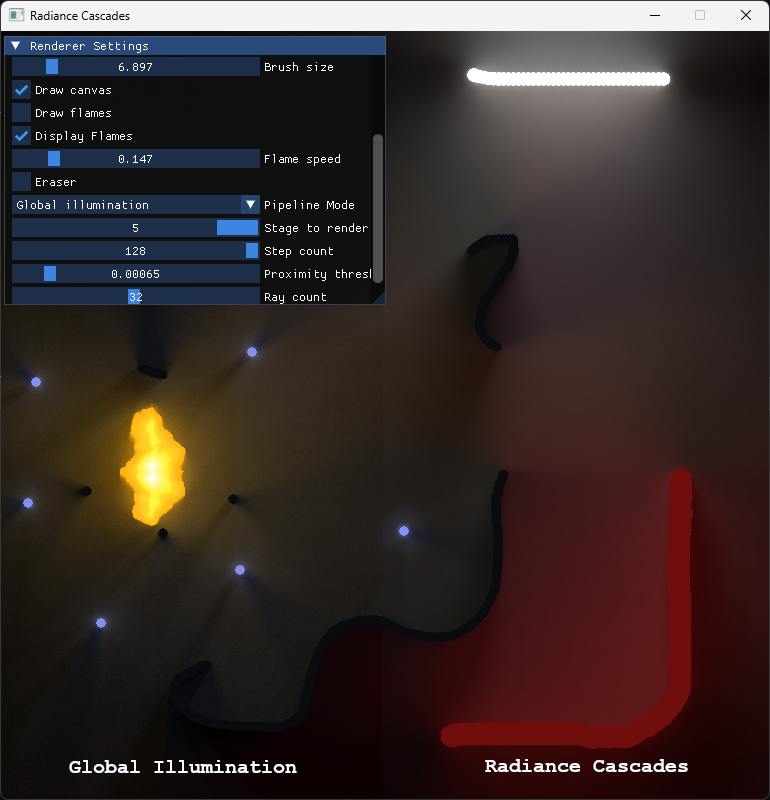
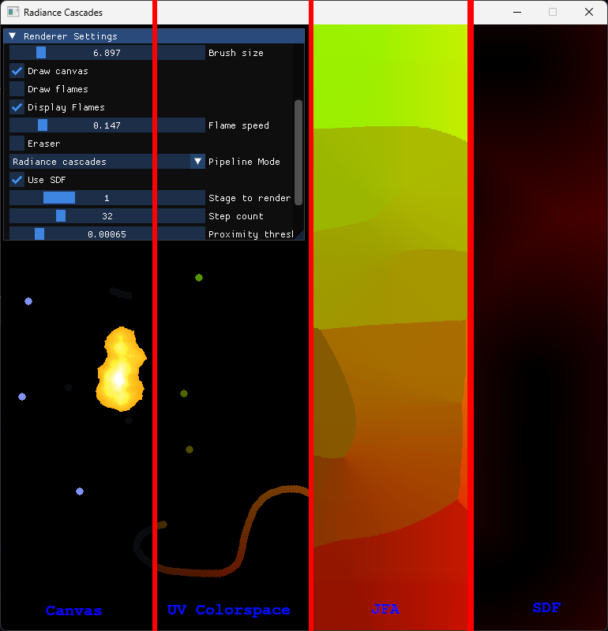

# Radiance Cascades

<p align="center">
  
</p>

An interactive 2D real-time global illumination playground written in C++23 and OpenGL. You draw occluders and emissive "flames" onto a canvas and watch the scene get lit in real time by one of several techniques. It is the companion application for a master's thesis on **Radiance Cascades**, and it implements three lighting methods side by side — classic path-traced global illumination, Radiance Cascades, and **Cached Radiance Cascades** (the thesis' own contribution) — together with a built-in per-stage performance profiler used to produce the measurements analysed in the thesis.

## Requirements

- A **C++23** compiler — **MinGW-w64 / GCC** (the presets invoke `gcc`/`g++` directly; `std::print` requires `libstdc++exp`, which GCC ≥ 14 ships).
- **CMake ≥ 4.0**.
- **Ninja**.
- A GPU/driver exposing an **OpenGL 4.3 core profile** context (shaders target GLSL `#version 430`).

Dependencies are handled automatically:

- **Fetched at configure time** by CMake `FetchContent` (pinned commits): [GLFW](https://github.com/glfw/glfw) and [GLM](https://github.com/g-truc/glm).
- **Vendored** in `sources/`: [glad](https://github.com/Dav1dde/glad) (OpenGL loader), [Dear ImGui](https://github.com/ocornut/imgui) (with the GLFW + OpenGL3 backends), and `stb_image_write`.

## Building

Build configurations are managed with CMake presets (`CMakePresets.json`):

```sh
cmake --preset release          # configure (or: debug)
cmake --build --preset release  # build     (or: debug)
./build/release/RadianceCascades.exe
```

Each configuration lives in its own tree:

- **release** — `-O3 -DNDEBUG`, output in `build/release/`.
- **debug** — `-O0 -g` plus libstdc++ assertions (`_GLIBCXX_ASSERTIONS`), a strong stack protector and frame pointers, output in `build/debug/`.

The `shaders/` directory is copied next to the executable automatically as a post-build step, so the binary must be run with that copied `shaders/` folder alongside it (as it is in `build/<preset>/`).

## Controls

- The window is a fixed **768×768** (non-resizable).
- **Draw** with the **RIGHT** mouse button.
- Interact with the settings panel using the **LEFT** mouse button.
- Press **ESC** to quit.

## Modes

Selectable from the **Pipeline Mode** dropdown:

- **Global illumination** — reference path tracer: every shaded pixel casts a configurable number of rays and ray-marches the scene.
- **Radiance cascades** — the Radiance Cascades algorithm.
- **Cached cascades** — the thesis' improvement. It trades memory for throughput by re-rendering higher cascade levels less frequently (each cascade level has its own configurable refresh interval), raising the frame rate.
- **Comparison** — renders Radiance Cascades and Cached Cascades from the same scene and visualises the per-pixel difference between them (treating plain Radiance Cascades as ground truth), with an adjustable range/scale.

<p align="center">
  
</p>

## Pipeline steps

Every mode runs the same front-end and swaps the final lighting node. The **Stage to render** slider lets you display any intermediate stage instead of the final image:

1. **Canvas** — the drawn occluders/colors.
2. **Flame generation** — animated emissive sources composited onto the canvas.
3. **Transformation to UV colorspace** — seed texture for the jump-flood pass.
4. **JFA** — Jump Flooding Algorithm, producing a nearest-seed map.
5. **SDF** — signed distance field derived from the JFA result, used to accelerate ray-marching.
6. **GI / RC / Cached RC / Comparison** — the selected lighting method.

Crucially, the slider only changes the texture that gets rendered to the screen; every frame all nodes generate their respective outputs.

## Settings

Scene / brush:

- **Brush color**.
- **Brush size** / **Flame size** (the slider follows whichever of _Draw canvas_ / _Draw flames_ is active).
- **Draw canvas**, **Draw flames**, **Display Flames** toggles, and **Flame speed**.
- **Eraser** toggle.
- **Clear** the canvas, or **Draw Predefined** to load a built-in test scene.
- **Save frames** — write rendered frames to disk as images.

Per-mode raymarching / cascade parameters:

- **Global illumination**: step count, proximity threshold, ray count, noise amount.
- **Radiance cascades**: _Use SDF_ toggle, step count, proximity threshold, base ray count, cascade count, ray overlap.
- **Cached cascades**: all of the Radiance Cascades parameters plus a per-cascade **render frequency** (how often each cascade level is refreshed).
- **Comparison**: the Radiance Cascades and Cached Cascades parameters plus a **Range** control for the difference visualisation.

## Measuring

The application has a built-in per-stage profiler used to generate the thesis measurements:

1. Click **Measure** — it times every pipeline node for the next 512 frames (the timing of each node's render pass, in **microseconds**).
2. Click **Save Results** — writes the samples to a `Measurement_<timestamp>.stats` file next to the executable.

The file has one row per node: the node name followed by its space-separated samples:

```
NodeName  sample1 sample2 sample3 ...
NodeName1 sample1 sample2 sample3 ...
```

Only the nodes that actually execute in the currently selected mode produce samples, so the rows present depend on which pipeline was active while measuring.
